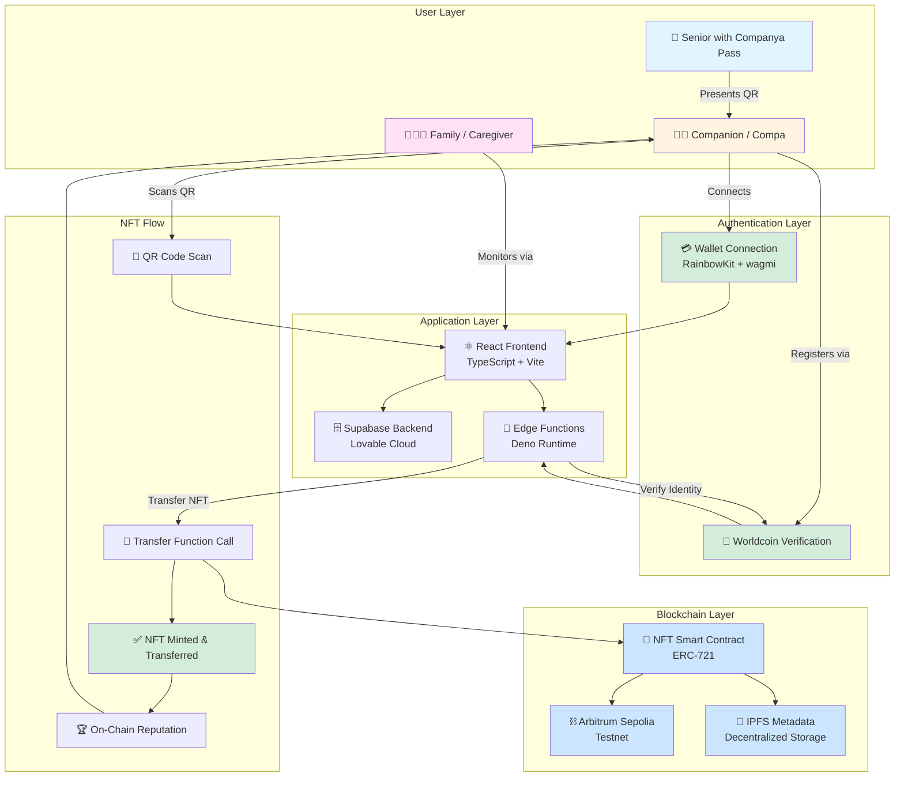
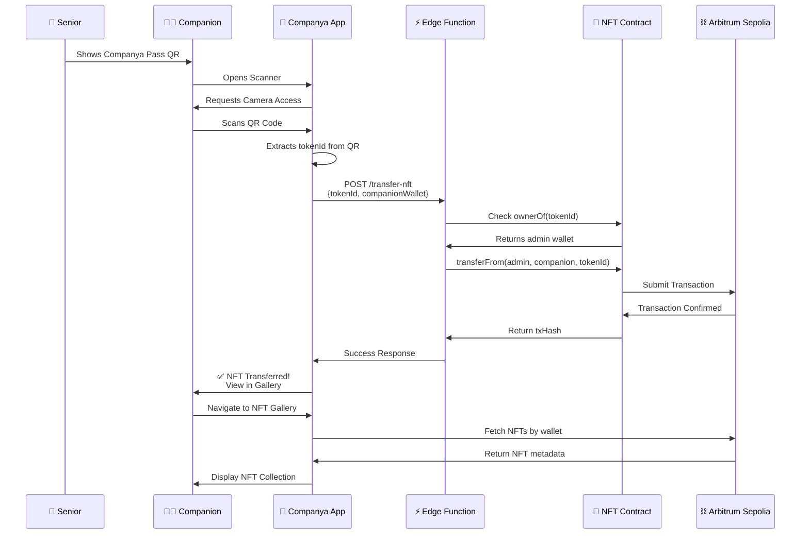

# 🌟 Companya - Web3-Powered Companion Services Platform

> **Real companionship, real traceability, real impact** - A decentralized platform connecting verified companions with seniors and families who care from afar.

[](https://companya.app)
[](https://lovable.dev)
[]()

---

## 📋 Table of Contents

- [Overview](#-overview)
- [The Problem We Solve](#-the-problem-we-solve)
- [Key Features](#-key-features)
- [Web3 Architecture](#-web3-architecture)
- [Tech Stack](#-tech-stack)
- [Getting Started](#-getting-started)
- [How It Works](#-how-it-works)
- [Deployment](#-deployment)
- [Project Structure](#-project-structure)

---

## 🎯 Overview

**Companya** is a revolutionary Web3-powered platform that bridges the gap between seniors who need companionship and verified companions ("Compas") who provide meaningful services. By leveraging blockchain technology, NFTs, and decentralized identity verification, we ensure every interaction is traceable, secure, and rewarding.

### 🏆 Why Companya Stands Out

- **🔐 Trustless Verification**: Worldcoin integration ensures human verification without compromising privacy
- **📱 Zero Tech Barrier for Seniors**: Physical "Companya Pass" (paper wallet) with QR codes - no apps required
- **💎 NFT-Based Rewards**: Every session minted as a collectible NFT, creating on-chain reputation
- **🌍 Global Reach**: Multi-language support (English/Spanish) with international accessibility
- **🔍 Complete Traceability**: Blockchain-powered transparency for families and caregivers
- **💰 Fair Compensation**: Direct wallet-to-wallet payments with transparent earnings tracking

---

## 🚨 The Problem We Solve

### For Families Living Abroad
- 😔 Unable to be physically present for aging parents
- 😰 Lack of trust in traditional companion services
- 📉 No visibility into service quality and usage
- 💸 Concerns about service transparency

### For Seniors
- 👴 Need companionship but overwhelmed by technology
- 🏥 Require assistance with daily activities and medical appointments
- 🤝 Desire meaningful social interactions

### For Companions
- 💼 Difficulty building verifiable professional reputation
- 💵 Irregular income and lack of formal recognition
- 📊 No centralized platform to manage services

---

## ✨ Key Features

### 🎫 **Physical "Companya Pass" System**
- Paper-based ticket booklets with individual QR codes
- No smartphone required for seniors
- Each ticket represents one companion session
- Pre-printed with recipient name, city, and activity type

### 👤 **Worldcoin Human Verification**
- Integration with World ID protocol
- Device-level and Orb-level verification support
- Prevents bot registrations and ensures real humans
- Privacy-preserving proof of personhood

### 💳 **Web3 Wallet Integration**
- RainbowKit + wagmi for seamless wallet connection
- Support for MetaMask, WalletConnect, and more
- Multi-chain support (Arbitrum Sepolia testnet)
- Direct ETH/token transfers for companion payments

### 🎨 **Dynamic NFT Minting**
- Each companion session generates a unique NFT
- Four categories: Social Connection, Health Support, Digital Assistance, Daily Tasks
- On-chain metadata stored on IPFS
- Transaction hash tracking for full transparency

### 📸 **Real-time QR Code Scanning**
- HTML5-based camera integration
- Instant NFT transfer upon successful scan
- Serverless edge functions for secure transfers
- Admin wallet management for NFT distribution

### 📊 **Companion Dashboard**
- Earnings tracking and withdrawal simulation
- Session history and completed hours
- NFT gallery with category filters
- Agenda management for upcoming sessions
- Breadcrumb navigation for intuitive UX

### 🌐 **Internationalization**
- Full i18next integration
- English and Spanish language support
- Browser language detection
- Contextual translations with proper slang

### 🔒 **Security & Privacy**
- Row Level Security (RLS) policies on all database tables
- Encrypted secret management for private keys
- Secure edge functions for blockchain interactions
- CORS-protected API endpoints

---

## 🏗️ Web3 Architecture



### 🔄 NFT Transfer Flow



---

## 🛠️ Tech Stack

### Frontend
- **React 18** - Modern UI library
- **TypeScript** - Type-safe development
- **Vite** - Lightning-fast build tool
- **Tailwind CSS** - Utility-first styling
- **shadcn/ui** - Beautiful component library
- **i18next** - Internationalization framework

### Web3 & Blockchain
- **wagmi** - React Hooks for Ethereum
- **RainbowKit** - Wallet connection UI
- **ethers.js v6** - Ethereum library
- **Arbitrum Sepolia** - Layer 2 testnet
- **IPFS** - Decentralized metadata storage

### Backend & Services
- **Supabase** - Backend as a Service (via Lovable Cloud)
- **Deno Edge Functions** - Serverless compute
- **Worldcoin IDKit** - Proof of personhood
- **html5-qrcode** - Camera-based QR scanning
- **qrcode** - QR code generation

### DevOps & Deployment
- **Lovable Cloud** - Integrated deployment platform
- **GitHub Actions** - CI/CD pipeline
- **ENS + IPFS** - Decentralized hosting option

---

## 🚀 Getting Started

### Prerequisites

```bash
# Required
Node.js >= 18.0.0
npm >= 9.0.0

# Optional for local development
Git
MetaMask or compatible Web3 wallet
```

### Installation

```bash
# 1. Clone the repository
git clone <YOUR_GIT_URL>
cd companya

# 2. Install dependencies
npm install

# 3. Set up environment variables
# The .env file is auto-generated by Lovable Cloud
# It includes:
# - VITE_SUPABASE_URL
# - VITE_SUPABASE_PUBLISHABLE_KEY
# - VITE_SUPABASE_PROJECT_ID

# 4. Start development server
npm run dev
```

### Environment Variables

The following secrets are managed via Lovable Cloud:

| Secret | Description | Usage |
|--------|-------------|-------|
| `ADMIN_WALLET_PRIVATE_KEY` | Admin wallet for NFT transfers | Edge Functions |
| `WORLDCOIN_APP_ID` | Worldcoin application ID | Identity verification |
| `SUPABASE_*` | Supabase credentials | Auto-configured |

---

## 📖 How It Works

### 1️⃣ **For Families/Caregivers (Companyers)**

```
Purchase Ticket Pack → Receive Physical Pass → Track Usage → View Reports
```

1. Visit the home page and select "Buy Ticket Pack"
2. Choose pack size (3, 5, or 10 sessions) or monthly program
3. Specify recipient details (name, city, country)
4. Complete payment (simulated in MVP)
5. Receive printed Companya Pass with QR codes
6. Monitor usage through blockchain traceability

### 2️⃣ **For Companions (Compas)**

```
Register → Verify Identity → Connect Wallet → Scan QR → Earn NFTs
```

1. Navigate to "I'm a Compa" page
2. Connect Web3 wallet (MetaMask, WalletConnect, etc.)
3. Complete KYC form with professional details
4. Verify humanity with Worldcoin (Device or Orb)
5. Access Companion Dashboard
6. Scan QR codes during/after sessions
7. Receive NFTs automatically transferred to wallet
8. Build on-chain reputation with collectible NFTs

### 3️⃣ **For Seniors**

```
Receive Pass → Show QR to Companion → Enjoy Service → No Tech Required
```

1. Receive physical Companya Pass from family
2. Keep booklet safe (like a checkbook)
3. When companion arrives, show next QR code
4. Companion scans QR to register session
5. Enjoy meaningful companionship and activities
6. No smartphone or technical knowledge needed

---

## 🌐 Deployment

### Option 1: Lovable Cloud (Recommended)

```bash
# Automatic deployment via Lovable platform
1. Open Lovable project: https://lovable.dev/projects/d911b6ce-90f6-4ee9-aeb2-7d59ee4f245d
2. Click "Share" → "Publish"
3. Frontend deployed instantly
4. Edge functions auto-deployed to Supabase
```

### Option 2: Self-Hosting

```bash
# Build for production
npm run build

# Preview production build
npm run preview

# Deploy to your preferred hosting
# - Vercel
# - Netlify
# - Cloudflare Pages
# - AWS Amplify
```

### Option 3: ENS + IPFS (Decentralized)

```bash
# Build static assets
npm run build

# Upload to IPFS
ipfs add -r dist/

# Update ENS resolver
# Point companya.eth to IPFS CID
# Access via: companya.eth.limo
```

---

## 📁 Project Structure

```
companya/
├── src/
│   ├── components/          # React components
│   │   ├── ui/             # shadcn/ui components
│   │   ├── Benefits.tsx    # Benefits section
│   │   ├── Hero.tsx        # Hero section
│   │   ├── HowItWorks.tsx  # How it works cards
│   │   ├── Navigation.tsx  # Main navigation
│   │   ├── Web3Trust.tsx   # Web3 trust visualization
│   │   └── ...
│   ├── pages/              # Route pages
│   │   ├── Index.tsx       # Home page
│   │   ├── Acompanante.tsx # Companion info page
│   │   ├── AcompananteDashboard.tsx
│   │   ├── AcompananteLogin.tsx
│   │   ├── AcompananteNFTs.tsx
│   │   ├── AcompananteScan.tsx
│   │   ├── RegistroAcompanante.tsx
│   │   ├── GenerarQRs.tsx  # QR batch generator
│   │   └── ...
│   ├── contexts/           # React contexts
│   │   └── Web3Provider.tsx
│   ├── hooks/              # Custom hooks
│   │   └── useCompanionNFTs.ts
│   ├── lib/                # Utilities
│   │   ├── utils.ts
│   │   └── wagmi-config.ts
│   ├── i18n/               # Internationalization
│   │   ├── config.ts
│   │   └── locales/
│   │       ├── en.json
│   │       └── es.json
│   ├── contracts/          # Smart contract ABIs
│   │   └── ColeccionServiciosNFT.json
│   └── integrations/       # Third-party integrations
│       └── supabase/
├── supabase/
│   ├── functions/          # Edge functions
│   │   ├── transfer-nft/
│   │   └── verify-worldcoin/
│   └── config.toml
├── public/                 # Static assets
├── index.html
├── package.json
├── tailwind.config.ts
├── vite.config.ts
└── README.md
```

---

## 🤝 Contributing

This is a hackathon project showcasing Web3 social impact. Contributions, issues, and feature requests are welcome!

---

## 📄 License

MIT License - feel free to use this project as inspiration for your own Web3 social impact applications.

---

## 🙏 Acknowledgments

- **Worldcoin** - For proof of personhood infrastructure
- **Arbitrum** - For affordable Layer 2 scaling
- **Lovable** - For rapid full-stack development platform
- **Supabase** - For backend infrastructure
- **RainbowKit** - For beautiful wallet connection UX

---

## 📞 Contact & Links

- **Live Demo**: [companya.app](https://companya.app)
- **ENS Domain**: companya.eth (via .limo gateway)
- **Lovable Project**: [lovable.dev](https://lovable.dev/projects/d911b6ce-90f6-4ee9-aeb2-7d59ee4f245d)

---

<div align="center">

**Built with ❤️ for social impact through Web3 technology**

*Connecting generations, one verified companion session at a time.*

</div>
